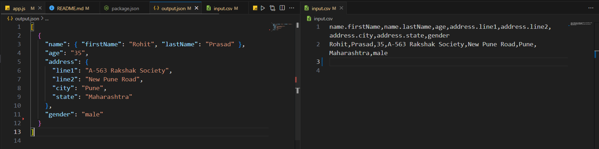
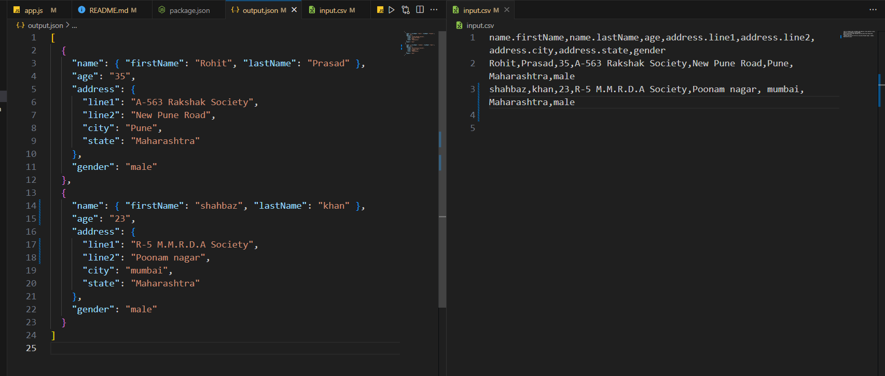
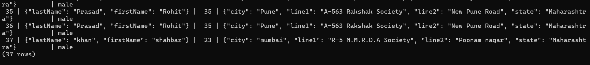
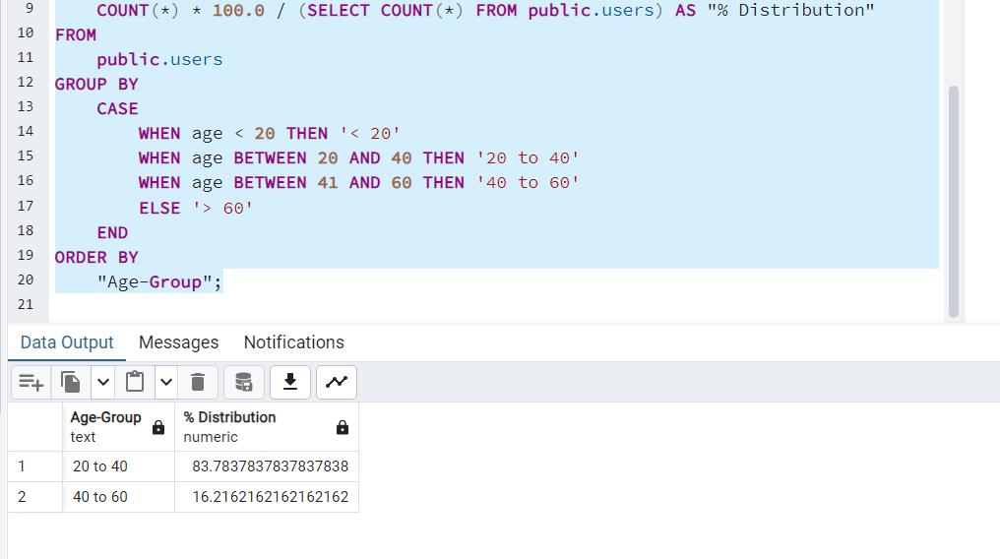

#  CSV files to JSON OBJECT and then store in postgreSQL then generating the age distribution report.

## Video link
https://youtu.be/PBlr_FWLFqs?si=NbkNeXzZWFoQqr8m

## Table of Contents

- [Introduction](#introduction)
- [Installation](#installation)
- [Usage](#usage)
- [Features](#features)


## Introduction

Provide a brief introduction to your project. What does it do? Why was it created? Any special considerations or prerequisites users should be aware of?

## Setup Node.js

```
npm init -y
```

## Installation

Include step-by-step instructions on how to install and set up your project. You should include any prerequisites or dependencies users need to install beforehand.

```bash
# Clone the repository
git clone https://github.com/Shahbaz898414/Assignment_placement01.git

# Navigate to the project directory
cd your_project

# Install dependencies
npm install
 
```

# Result
## Before


## Run on command prompt
```
node app.js
```

## After


## PostgreSQL Store


## Age distribution report

